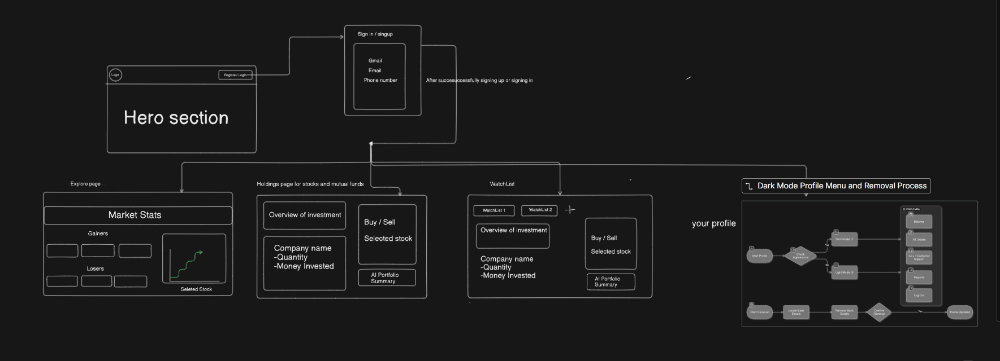

# 📈 Upward – Trading App Clone  

A **full-stack trading platform** inspired by **Groww**, built with **React (TypeScript)** for the frontend and **Spring Boot** for the backend.  
This project simulates trading features like authentication, portfolio management, and mock stock transactions. It is also a real-time market data tracking platform designed to keep investors effortlessly informed. It provides secure user management, portfolio/watchlist APIs, real-time trade feeds, and AI-powered company insights. 

---

## 🛠️ Quick Start  

### Clone the repository  
```bash
git clone https://github.com/your-username/upward-trading-clone.git
```
### Frontend setup
```bash
cd upward-front
npm install
npm start
```
### Backend Setup
```bash
cd upward-trading-clone/upward-back
mvn spring-boot:run
```
---

## 🚀 Tech Stack  

### Frontend (React + TypeScript)  
- ⚛️ React + TypeScript  
- 🎨 TailwindCSS  
- 📊 Recharts (Data Visualization)  
- 📦 Axios (API calls)  

### Backend (Spring Boot)  
- ☕ Java + Spring Boot  
- 🗄️ PostgreSQL/MySQL  
- 🔒 Spring Security + JWT  
- 📑 Maven (Dependency Management)  

---

## ⚡ Features  
- 🔐 User Authentication (Signup/Login with JWT)  
- 📊 Portfolio Dashboard (Track Holdings & Investments)  
- 💵 Mock Buy & Sell Stocks  
- 📜 Transaction History  
- 📈 Real-Time Charts  

---

## Frontend Architechture


Here’s the current frontend plan for **Upward**:



